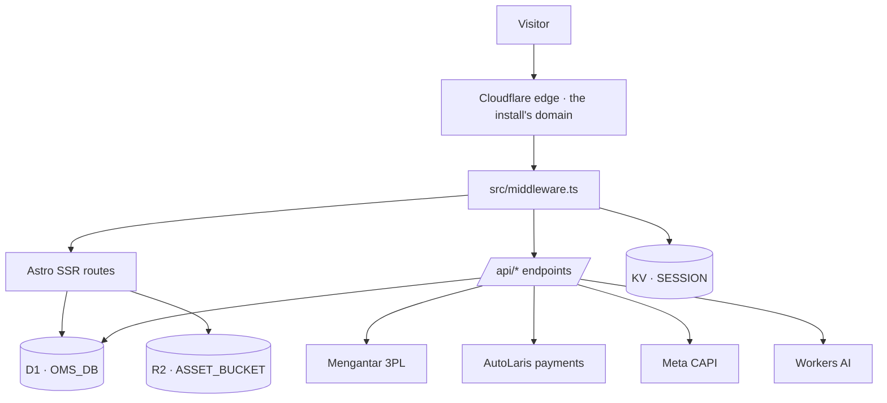

# AdsBookCMS — System Architecture

> **Product:** AdsBookCMS (single) — a self-contained direct-response commerce CMS that installs onto Cloudflare Workers.
> **Install model:** **1 installer = 1 Worker = 1 store.** Isolation comes from the deployment boundary, not from request-time tenant routing.
> **This repository:** the product. It deploys nothing; each install deploys from its own repository against its own resources.
> **First install:** `permatamall.shop`, in the separate `ongkipro/permatamall` repository, carrying its own catalogue in its own database. Its `cmsads-*` resource names are legacy and deliberately not renamed.
> Verified against disk: 2026-08-17 @ `5cb1d32` + current A11 working tree

This document describes what the system **actually is**. Where the intended AdsBookCMS product differs from what ships today, the gap is stated explicitly in §10 rather than written as if it were already true. Code and executable evidence win over this document; when they disagree, fix the document.

---

## 1. Install Model

An AdsBookCMS install is one Cloudflare Worker with its own private resources:

| Resource | Binding | Instance value (reference deployment) |
| --- | --- | --- |
| Worker | — | one per install, named by that install |
| D1 database | `OMS_DB` | one per install |
| KV namespace | `SESSION` | sessions, rate-limit counters, idempotency keys |
| R2 bucket | `ASSET_BUCKET` | product uploads + CMS media |
| Workers AI | `AI` | optional platform binding; not used by the public content workflow |
| Static assets | `ASSETS` | `dist/client`, served by the Cloudflare adapter |

There is **no `env.<tenant>` block** in `wrangler.jsonc` and `definedEnvironments` in the built config is empty. One repository checkout deploys exactly one store. A second store means a second install: separate Worker, separate D1, separate bucket, separate domain.

**Why single-install instead of shared multi-tenant.** A shared runtime would require every query, cache key, session key, R2 object key, webhook lookup, and provider credential to carry a verified store scope. Today the data layer legitimately assumes one logical merchant (`SELECT ... FROM stores ORDER BY id LIMIT 1` is the canonical store read). Cloudflare also does not allow selecting a D1 binding from request input, so "one Worker, many databases" is not available without Workers for Platforms. The platform boundary is therefore the isolation boundary. See `DECISIONS.md` ADR-001.

---

## 2. Runtime Topology



Every route is server-rendered: `astro.config.mjs` sets `output: 'server'` with the Cloudflare adapter. Nothing is prerendered, which is why the sitemap is hand-authored at `src/pages/sitemap.xml.ts` instead of using `@astrojs/sitemap`.

### Middleware responsibilities (`src/middleware.ts`)

Runs on every request, in order: canonical host redirect (`www` → apex), ad click-ID capture into first-party cookies, admin session validation against KV + `admin_credentials`, role-based admin route policy, same-origin enforcement on unsafe admin API methods, and the embed frame policy (replaces `X-Frame-Options: DENY` with a `frame-ancestors` CSP built from `stores.embed_allowed_origins`, failing closed to an empty allowlist on database error).

---

## 3. Route Surface

| Family | Entry points |
| --- | --- |
| Storefront | `/`, `/produk`, `/produk/[slug]`, `/404`, `/thanks`, `/payment` |
| Content pages | `/tentang`, `/kontak`, `/testimoni`, `/sitemap`, `/disclaimer`, `/kebijakan-privasi`, `/kebijakan-cookie`, `/syarat-ketentuan`, `/pengiriman` |
| Landing pages | `/[slug]` — catch-all resolved from D1 `landing_pages`; falls back to a 308 to `/produk/<slug>` when the slug is a product, else 404. Supports `?preview=1` behind an admin session |
| Checkout forms | `/hybrid-form`, `/middle-form`, `/full-form`, `/geoipform`, `/embed/form`. `/form-hybrid`, `/form-middle`, `/form-full` are query-preserving 308 redirects that **do** exist |
| Feeds | `/sitemap.xml`, `/feed/google-catalog.xml`, `/feed/meta-catalog.xml`, static `/robots.txt` |
| Media | `/assets/[...key]` (R2 `uploads/` prefix), `/media/[...key]` (R2 `content/` prefix) |
| Admin | `/hello` (login), `/admin/*` — 27 pages |
| Public API | `/api/*` — checkout, locations, shipping rates, payment methods, order status, Meta events |
| Headless API | `/api/v1/*` — storefront descriptor, products, geo, shipping rates, checkout, tracking events |
| Admin payment reconciliation | `/api/admin/payment-reconciliation` |

The headless `/api/v1/*` family is **implemented and shipping**, authenticated by `X-App-Key`/`Bearer` against the `developer_api_keys` table (`src/lib/headless-api.ts`) plus an origin allowlist. Keys are issued at `/admin/settings/developer`.

---

## 4. Data Layer

D1 is the only persistent store for operational state. **All runtime data access is raw `D1Database.prepare()` / `.batch()`** across 45 modules. There is no ORM and no schema-generation step: Drizzle was removed on 2026-08-16 (ADR-005), so `src/db/migrations/*.sql` is the only description of the schema in the tree.

### Tables (21)

`stores` · `warehouses` · `products` · `product_variants` · `orders` · `order_items` · `order_number_counters` · `courier_rules` · `pickup_schedules` · `admin_credentials` · `payment_transactions` · `storefront_content` · `storefront_templates` · `provider_dispatch_locks` · `seller_bank_accounts` · `capi_event_outbox` · `developer_api_keys` · `developer_api_key_usage` · `headless_api_audit_events` · `landing_pages` · `landing_sections`

`stores` is a single-row table that carries the runtime-editable half of the configuration: provider keys and base URLs, tracking IDs, fee-bearer policy, payment toggles, CRM templates, embed origins, AI content instructions, and COD province exclusions.

Stock integrity is enforced by the database, not the application: trigger `product_variants_stock_nonnegative` (migration `0003`) raises `INSUFFICIENT_STOCK` on any negative stock write.

### Migration chain

41 files, `0000`–`0040`. The Worker bundle contains the exact checked-in SQL and applies any missing suffix automatically before serving a database-backed request. Each migration's SQL statements and `d1_migrations` claim row execute in one D1 batch; concurrent requests serialize on the claim, re-read history, and continue without double-applying. `wrangler d1 migrations apply OMS_DB` remains an optional operator preflight, not the runtime correctness boundary. Migration `0040` adds provider status text, provider event time, and synchronization time to `orders`.

**Migrations are hand-authored.** There is no generator to keep in sync, which is deliberate: the schema contains data-integrity triggers, ordered indexes, CHECK constraints, and data migrations that a schema generator cannot represent safely.

---

## 5. Configuration Resolution — the sharpest edge in the system

Configuration comes from **three independent sources** that are easy to mistake for one:

| Source | Read path | Changes take effect after |
| --- | --- | --- |
| **D1 `stores` row** | `readStoreIdentity` → `resolveTenantConfig` in `src/lib/tenant.ts` | immediately |
| **Worker runtime env** | `getRuntimeEnv(locals)` in `src/lib/env.ts` | deploy (no rebuild needed) |
| **Build-time bundle** | `import.meta.env`, via `envTenantConfig` | `astro build` + deploy |
| **D1 `stores` row (provider half)** | `provider-config.ts`, `store-ads.ts`, `public-store.ts` | immediately |

Identity resolves **row first, env second, product default last**. Middleware reads
the `stores` row once per request and puts the resolved config on
`Astro.locals.tenant`, so the 125 consumers stay synchronous (ADR-003). The
`PUBLIC_SITE_*` vars are the fallback for a store that has not set a field, and
they do reach the bundle: `import.meta.env` is frozen by Astro at build time and
both `wrangler.jsonc` `vars` and a local `.env` feed it — verified by changing a
var in `wrangler.jsonc` alone and observing the new value in
`dist/server/chunks/env_*.mjs`.

> §5 previously described identity as baked into the bundle, and stated that
> `stores.name` and the resolved name were *different values*. That was true
> before migration `0036` and gap G1's closure, and it contradicted §10 four rows
> below. It also named a symbol, `tenantConfig`, that does not exist; the exports
> are `resolveTenantConfig`, `envTenantConfig`, `readStoreIdentity` and
> `loadStoreIdentity`.

Things to understand before touching identity:

- Renaming the store in `/admin` moves every storefront `<title>`, header,
  footer, JSON-LD and OG tag on the next request. No rebuild.
- `slug` resolves from `stores.slug`, then `PUBLIC_TENANT_SLUG`, then `"adsbook"`.
  The install wizard writes it per install. It is diagnostic only.
- An unknown `PUBLIC_STOREFRONT_TEMPLATE` **no longer throws**. It logs
  `tenant-unknown-storefront-template` and degrades to `compact-market`;
  `tenant.test.ts` asserts exactly that. It used to throw at module load, which
  in a Worker meant every route returned 500.
- `theme_color`, `locale` and `admin_name` have no admin editor yet. The store
  settings screen edits six fields: name, site_url, description, tagline, logo,
  storefront_template.

Provider credentials follow a **D1-first, env-fallback** rule: a key saved in the admin dashboard wins over the deployed secret, and `provider-config.ts` reports which one won as `source: "dashboard" | "server" | "none"`.

---

## 6. Authentication and Access

Session is a signed JWT in the `adsbook_session` cookie (`SESSION_COOKIE_NAME` in `src/lib/auth.ts` — the single source for the name), verified in middleware against a KV record and the `admin_credentials` row. `admin_credentials.updated_at` doubles as a session revision: rotating a credential invalidates existing sessions. Roles are defined in `src/lib/auth.ts` (`ADMIN_ROLES`) and enforced per route by `canAccessAdminRoute`.

The login route is `/hello` rather than `/admin/login`, and `robots.txt` — served from `src/pages/robots.txt.ts`, not a static file —
disallows `/admin/`, `/api/`, `/embed/`, `/hello` and `/install` **inside every
user-agent group**. Per RFC 9309 a crawler obeys only its most specific matching
group, so the named groups for Googlebot, Bingbot and the AI crawlers each need
their own copy; when they held nothing but `Allow: /`, those six crawlers saw no
disallows at all.

`src/lib/auth.ts` is covered by `src/lib/auth.test.ts` — 15 tests over signing,
verification, claim validation, role routing and the middleware gate itself,
including the normalized-path shapes that once walked past it.

> This paragraph used to read "currently has **no test coverage** … the
> highest-risk untested module in the repository", while that suite sat beside
> it. Believing it invites either a redundant second suite or an edit to
> `auth.ts` made on the assumption that nothing would catch it.

---

## 7. Commerce Flow

1. **Catalog** — `products` + `product_variants` in D1 carry identity, price, weight, and stock. `src/lib/catalog.ts` merges those operational rows with published presentation JSON from `storefront_content`.
2. **Form** — `/hybrid-form` resolves COD eligibility from trusted Cloudflare geo; a known eligible province routes to the middle form, a disabled or unknown province routes to the full form (`src/lib/form-mode.ts`).
3. **Rates** — `/api/shipping-rates` quotes Mengantar for the resolved destination, filtered by `courier_rules` and store-level COD province exclusions.
4. **Submit** — `/api/submit-order` persists order, items, and stock reservation atomically. It is rate-limited, honeypot-guarded, and idempotent via `submit_token`. **Checkout never dispatches to the courier.**
5. **Payment** — online orders create one AutoLaris payment through `POST /api/h2h/create_payment`. AutoLaris is a payment gateway here and nothing else: shipping belongs to Mengantar, so no origin, destination, courier, weight, or parcel detail is sent, and the combined shipping-and-payment path `POST /api/h2h/submit` is deliberately unused. The adapter sends the buyer's payment identity and the fee-policy amount from D1, and enforces the three provider constraints that return an undifferentiated `Invalid parameter`: a digits-only `reff_id` derived from the order number, a non-empty `customer_id`, and a non-empty `callback_url`. That callback URL is this install's own retired webhook route, which answers `410` — the install registers an address and declines callbacks rather than leaving the field empty. `AutoLarisClient.inquirePayment` reads one transaction through `POST /api/h2h/advice`, but classifies only the observed `rc: "02"` as pending; no settled response has been captured, so only the owner/admin manual-reconciliation boundary may mark AutoLaris paid: exact amount/reference re-entry, explicit acknowledgement, immutable actor/status snapshots, and one atomic idempotent transition. The public payment page reads that D1 state and redirects to `/thanks`; neither confirmation nor its one-minute queue refresh dispatches shipment.
6. **Dispatch** — an operator explicitly pushes eligible orders to Mengantar from `/admin/orders`. Requests run sequentially under a `provider_dispatch_locks` lease. Only an accepted provider response moves an order to `processing`.
7. **Provider status synchronization** — `/admin/shipping` explicitly polls Mengantar `GET /order?tracking_id=<cnote_no>` through the configured server-side client. Eligible rows are processed sequentially; raw provider status evidence is persisted, and only monotonic lifecycle advances pass through the shared atomic order-lifecycle boundary.
8. **Ad tracking** — browser Pixel plus server-side Meta CAPI through `capi_event_outbox`, a durable transactional outbox with retry and a shared per-order `event_id` for deduplication.

---

## 8. Content Management

Two independent content systems:

- **Storefront content** (`storefront_content`) — legacy draft/published presentation records remain preserved for migration compatibility. Public homepage availability no longer depends on a published home record; active catalog rows remain the authority for product identity, price, stock, and listing.
- **Landing pages** (`landing_pages` + `landing_sections`) — an ordered section builder with `html` and `form` section types, rendered by the `/[slug]` catch-all.

Missing optional homepage content falls back to a neutral catalog composition.
The current `admin/content` JSON/AI workbench is retired from navigation; A18
defines its replacement as a bounded field editor for banner, slider, and copy.
content. No compiled or generated merchant-facing fallback copy runs in that path.

---

## 9. Build and Release

```
this repo:   push to main → .github/workflows/ci.yml → npm ci → npm run check → npm test → npm run build → stop
an install:  push to main → its own deploy workflow → …same gates… → npx wrangler deploy → live traffic
```

**This repository deploys nothing.** CI runs check, test and build. Deployment happens from an install's own repository, against that install's Worker and database, and pushing to `main` there is what reaches live traffic. Release detail lives in `RELEASE.md`.

Local verification, in the order CI runs it:

```bash
npm test          # node --test over src/lib/*.test.ts
npm run check     # astro check && tsc --noEmit
npm run build     # astro build
```

npm is authoritative (`package-lock.json`, `npm ci` in CI). This is a single-package repository; the pnpm workspace stub and its stale lockfile were removed on 2026-08-16 and neither file exists.

---

## 10. Gap Register — what AdsBookCMS still needs

These rows record the original architecture gaps and their closures. **No item in
this register remains open.** Remaining audited defects and blocked provider work
live in `UNIMPLEMENTED_SPECS.md`.

| # | Gap | Why it blocks the installer | Primary surface |
| --- | --- | --- | --- |
| ~~G1~~ | ~~Identity is build-time~~ | **Closed 2026-08-16.** Migration 0036 moved identity into `stores`; middleware resolves it once per request onto `Astro.locals.tenant`; `/admin/settings/store` edits six of the nine fields (`theme_color`, `locale` and `admin_name` have no editor yet) without a rebuild | `src/lib/tenant.ts`, `src/middleware.ts` |
| ~~G2~~ | ~~No `/install` wizard~~ | **Closed 2026-08-16.** A migrated database with no store row routes to `/install`; the wizard writes identity and the operator's credential in one batch and then refuses to run again | `src/pages/install.astro`, `src/lib/install.ts` |
| ~~G3~~ | ~~No schema auto-upgrade~~ | **Closed 2026-08-17.** The Worker embeds the checked-in chain and atomically applies its missing suffix before database-backed requests; invalid, unknown, or ahead history fails closed | `src/lib/schema-version.ts`, `src/lib/bundled-migrations.ts`, middleware |
| ~~G4~~ | ~~Sample product is another merchant's~~ | **Closed 2026-08-16.** Migration `0034` removes the foreign row under identity and order-reference guards; the immutability concept was dropped rather than repointed, since the demo catalog already serves the purpose and is fully editable | `src/db/migrations/0034_remove_foreign_sample_product.sql` |
| ~~G5~~ | ~~Home shell falls back to built-in copy~~ | **Closed 2026-08-17.** Missing published home content returns `setup-required`; the built-in home and Headless descriptor expose an explicit setup state without compiled merchant copy | `src/lib/tenant-content.ts`, `src/pages/index.astro`, `src/pages/api/v1/storefront.ts` |
| ~~G6~~ | ~~Theme set is compile-time~~ | **Closed 2026-08-17.** Migration `0039` adds editable D1 template definitions; built-in layouts render runtime composition and operator-created definitions require no rebuild | `src/lib/storefront-template.ts`, `/admin/settings/store` |
| ~~G7~~ | ~~Partial observability with no alerting~~ | **Closed 2026-08-17 for actionable per-install alerts.** The scheduled Worker evaluates schema and CAPI outbox health, persists transition state in KV, and sends deduplicated firing/recovery webhook events without commerce payloads. External uptime and cross-install aggregation remain separate product decisions | `src/lib/operational-alerts.ts`, `src/worker.ts`, `OBSERVABILITY.md` |
| ~~G8~~ | ~~Drizzle journal broken~~ | **Closed 2026-08-16.** Drizzle retired rather than repaired: its snapshots could not represent the stock trigger, so a repaired generator would have emitted SQL that silently dropped a data-integrity guarantee (ADR-005) | — |
| ~~G9~~ | ~~Meta Purchase deduplication is broken~~ | **Closed 2026-08-16.** Both legs now key on the `INV-` order number. Historical data stays inflated — Meta offers no retroactive merge | `src/components/tracking/MetaThanksTracker.astro` |
| ~~G10~~ | ~~Embedded checkout fired Purchase before verified confirmation~~ | **Closed 2026-08-16.** Embedded forms now send only a constrained completion-navigation message; the parent navigates to the same verified `/payment` or `/thanks` flow, whose browser and CAPI legs share the order number as `event_id` | `src/lib/embed-markup.ts`, `src/lib/checkout-navigation.ts` |

---

## 11. Non-Goals

- Request-time tenant routing by `Host` inside one Worker.
- Selecting a D1 binding from request input.
- Workers for Platforms / customer-authored Worker code.
- Public self-service signup. Installs are provisioned deliberately, one at a time.
