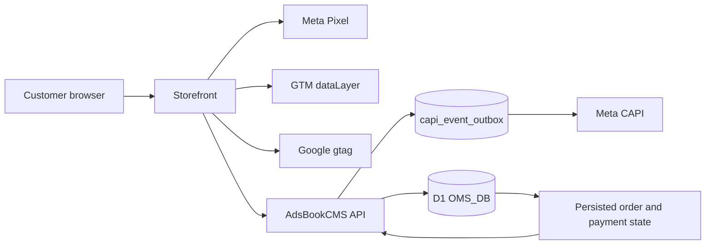

# AdsBookCMS Meta Pixel, CAPI, GTM, and Google Ads Specification

> Verified against disk: 2026-08-29 @ `9766ad6`

This document owns the technical tracking contract for AdsBookCMS-rendered and headless storefronts. It covers event semantics, identity, browser/server boundaries, deduplication, durable delivery, store configuration, and verification. It does not claim attribution certainty, legal compliance, consent applicability, or live provider acceptance.

AdsBookCMS installs as **one Worker = one store** ([`ARCHITECTURE.md`](./ARCHITECTURE.md), [`DECISIONS.md`](./DECISIONS.md) ADR-001/ADR-002), so "store configuration" below always means the single `stores` row of this install, resolved at request time from D1 with environment fallback.

## 1. Architecture



The storefront owns browser tag loading and event presentation. AdsBookCMS owns tracking configuration, public payload validation, canonical catalog/order identity, Purchase qualification, durable CAPI delivery, and server CAPI credentials.

A headless storefront may use a different framework and design, but it must not fork event meaning, product identity, or Purchase qualification.

## 2. Current Implementation Boundary

### Implemented in AdsBookCMS-rendered routes

- `MetaPixelBase.astro` resolves a valid Pixel ID from D1 with environment fallback.
- `GtmBase.astro` resolves and validates the GTM container ID.
- `GoogleAdsBase.astro` resolves a complete Google Ads conversion ID/label pair, emits the region-scoped Consent Mode v2 defaults (§10), and exposes `window.__PS_PUSH_GOOGLE_CONVERSION__`.
- Page, product, landing, and thanks trackers emit the supported browser events.
- `/api/meta-event` accepts only supported event names and validates event ID, same-origin source URL, product/value payload, and bounded customer data before enqueueing to the CAPI outbox.
- `/api/v1/tracking/events` provides the same contract for headless storefronts behind developer-API-key auth (§12).
- `src/lib/capi-outbox.ts` records every CAPI event in D1 before transmission and retries failures (§11).
- Click identifiers are captured in middleware into a first-party cookie and persisted on the order (§7).
- `/admin/ads/meta` manages Pixel ID plus masked CAPI readiness and supports an explicit Test Events request.
- `/admin/ads/google` manages GTM independently and validates the Google Ads conversion pair.
- `/thanks` gates Purchase from recorded order/payment state and uses browser duplicate guards.

### Headless storefront bootstrap — what ships and what does not

`src/pages/api/v1/storefront.ts` **ships** a storefront bootstrap endpoint. `GET /api/v1/storefront` returns store identity, home content, payment capability (COD flag, COD-disabled province codes, supported methods), and a `tracking` block containing exactly four non-secret identifiers:

- `meta_pixel_id`
- `google_ads_conversion_id`
- `google_ads_conversion_label`
- `google_tag_manager_id`

`meta_capi_token` is never in the response. It is not a keyless public endpoint: `validateHeadlessRequest()` requires a developer API key via `X-App-Key`, `X-Api-Key`, or `Authorization: Bearer`, verifies it against `developer_api_keys` (SHA-256 lookup plus secret verification, revoked keys rejected), and then enforces the origin allowlist.

Genuinely not yet implemented:

- a **keyless** public bootstrap for storefronts that cannot hold a server-side key;
- a framework-neutral tracking adapter package;
- a completed cross-storefront consent adapter;
- automated verification across every external storefront repository.

Do not expose `meta_capi_token` to solve the keyless-bootstrap gap. See [`STOREFRONT_INTEGRATION.md`](./STOREFRONT_INTEGRATION.md) for the planned adapter boundary.

## 3. Store Configuration

`getStoreAdsConfig(locals)` resolves:

- `meta_pixel_id` and `meta_capi_token`;
- `google_tag_manager_id`;
- `google_ads_conversion_id` and `google_ads_conversion_label`.

D1 values take precedence over environment fallback. Changes in Ads & Tracking apply to subsequent requests without rebuilding the Worker.

Security rules:

- CAPI tokens and webhook secrets are never returned by read APIs;
- blank token submissions preserve the active secret;
- Google Ads conversion ID and label are both present or both absent;
- browser configuration may contain only non-secret identifiers;
- isolation between stores is the deployment boundary — a second store is a second install with its own D1 and its own credentials, not a scope column.

## 4. Canonical Event Semantics

| Meta event | GTM event | Browser trigger | Qualification |
| --- | --- | --- | --- |
| `PageView` | `page_view` | Eligible page load | Tag and consent state permit browser tracking. |
| `ViewContent` | `view_item` | One canonical product is viewed | Canonical D1 product ID and current D1 value. |
| `AddToCart` | `add_to_cart` | Current direct-response form reaches qualified customer intent | Never a scroll, impression, or arbitrary CTA click. |
| `InitiateCheckout` | `begin_checkout` | A valid checkout submit attempt begins | Product, variant, value, and customer boundary have passed browser validation; server still revalidates. |
| `Purchase` | `purchase` | The qualifying persisted order state is confirmed | COD requires persisted order success; online payment requires authenticated paid reconciliation, which itself enqueues the server CAPI Purchase (same `INV-` event id, so a browser leg that already fired is a no-op) for buyers who never return to `/thanks`. |

`src/lib/meta-event-contract.ts` accepts exactly these five names. The repository does not map every interaction to `Lead` or `Purchase`. Analytics UI events must remain separate from optimization events.

## 4a. One `fbq('init')` per pixel id — the whole page gets one chance

**`fbq('init', pixelId, advancedMatching)` is honoured exactly once per pixel
id.** A later init carrying more keys is not merged, not an error, and not
logged. It is discarded in silence.

This was verified against the live `fbevents.js`, not inferred. With an init
carrying `{ external_id }` followed by an init carrying
`ph/fn/ln/ct/st/zp/country/external_id`, `fbq.instance.pixelsByID[id].userData`
held one key. After the fix it holds eight.

Three call sites init'd behind `MetaPixelBase`'s bootstrap —
`MetaThanksTracker.astro`, `form-hybrid.ts`, `form-middle.ts`. Every advanced
matching object they built and SHA-256 hashed was thrown away, so the browser
leg of a Purchase reached Meta matched on `external_id` alone while the server
leg matched on eight keys. Nothing anywhere reported it.

The contract that replaces it:

- **`MetaPixelBase.astro` owns the only init**, and exposes
  `window.__PS_META_INIT__(advancedMatching)`. First caller wins; it returns
  `false` to a later one instead of pretending.
- **A page with better matching declares `window.__PS_META_AWAIT_MATCHING__ =
  true`** before the pixel component runs. `/thanks` does this in the head slot
  `BaseLayout` renders ahead of `MetaPixelBase`, because its eight keys are only
  known once `/api/order-status` has answered. The wait is bounded at 4 s inside
  the pixel: a failed fetch must cost the better matching, never the `PageView`.
- **Nothing else calls `fbq('init')`.** `meta-identity.test.ts` scans the thanks
  tracker's source (comments stripped) and fails if one reappears;
  `meta-purchase-dedup.test.ts` fails if the tracker issues one at runtime.
- **A form page cannot upgrade its matching.** The pixel has already initialised
  by the time a buyer types anything, so `AddToCart` and `InitiateCheckout`
  carry `external_id` on the browser leg and the full identity on the CAPI leg,
  which is read server-side and is not subject to this constraint.

### The advanced-matching key set

`ph`, `fn`, `ln`, `ct`, `st`, `zp`, `country`, `external_id` — and nothing else.

`client_user_agent` used to be sent here and has been removed. It is a
Conversions API field; Meta's Pixel advanced-matching reference does not list
it, and the browser attaches its own user agent to the request regardless.

### A conversion never waits on the deferral timer

`fbevents.js` is deferred behind an interaction listener and a 2.5 s timer
(§1). The stub queues an `fbq('track')` call, but nothing is transmitted until
the library arrives, and a buyer who reads `/thanks` and closes it triggers
neither trigger. `MetaPixelBase` therefore exposes
`window.__PS_LOAD_META_PIXEL__`, the exact counterpart of the
`__PS_LOAD_GOOGLE_TAG__` hatch the Google leg has always had, and the Purchase
pulls the download forward itself. Measured on the real library: 2522 ms to
45 ms.

## 5. Product Catalog Identity

Every product event carries the **catalog item id** in `content_ids`: the
immutable numeric D1 Product ID, minimum five digits, decimal, no prefix — for
example `10001`. That is the same string the Google and Meta feeds publish as
`<g:id>`, and it has to be byte-identical or Advantage+ and Dynamic Product Ads
match nothing — silently, with no error and no diagnostic anywhere.

**The catalog is product-level (ADR-017).** One item per product; variants are
checkout choices and create no catalog identity, so no event ever carries a
variant in `content_ids` and neither feed emits `item_group_id`. Where the page
has no chosen variant (a product page, a landing page),
`defaultCatalogContentId` still returns the product's id — the variant only
decides the price the storefront shows.

`src/lib/catalog-feed.ts` is the single source of that id; `catalog-identity.ts`
proves feed output and Pixel payload against each other rather than against a
fixture, because a fixture is how three different values once passed CI.

Two corrections this section has already had to absorb, both worth keeping:

- Until 2026-08-17 it said the bare D1 `products.id` — which is what the Pixel
  actually sent, while the feed published `10000 + id`. Nothing matched.
- Until 2026-08-28 it still described the variant-level `p{product_id}-v{variant_id}`
  scheme, which ADR-017 had already replaced. The code was right; the contract
  document was months stale, and `catalog-identity.test.ts` had been failing any
  source that reintroduced `p${productId}-v${...}` the whole time.

### A row that cannot publish is skipped, not fatal

`catalogProductId` throws on an id that predates the five-digit scheme, and that
is correct for a single ads payload: a padded or guessed identity is worse than
none. Inside the feed loop it was wrong. Both feed routes catch and return a
500 stub, so one legacy row — an import, a hand-inserted product — meant
Merchant Center and Meta Commerce fetched an empty catalog and disapproved every
product, not the one that could not be published. The generators now read
`catalogProductIdOrNull` and omit that item; `defaultCatalogContentId` does the
same on a product page, which then sells normally but cannot be retargeted.

- D1 product ID: tracking and external catalog identity.
- D1 variant ID: order selection identity when variant detail is needed.
- Slug: routing label only.
- SKU: internal inventory label only.
- Frontend list index, campaign alias, provider ID, or legacy seed name: invalid tracking identity.

`ViewContent`, `AddToCart`, `InitiateCheckout`, browser Purchase, server CAPI Purchase, and any Meta Commerce Catalog integration must agree on the same product ID.

## 6. Event ID and Purchase Deduplication

### Intended contract

A funnel event and a Purchase event must not reuse one ID.

1. Create a dedicated Purchase event ID for the order attempt.
2. Return and preserve that ID with the persisted order state.
3. Browser Pixel Purchase and server CAPI Purchase use the identical string.
4. The thanks flow applies both browser guards:
   - `once('Purchase_' + purchaseEventId)`;
   - `once('Purchase_order_' + orderId)`.
5. Refresh, revisit, duplicate callback, or repeated polling must not create another Purchase for the same qualifying order.
6. A new valid order receives a new Purchase event ID.

### What ships today

All six guards hold as of 2026-08-16. Both legs key Purchase on the `INV-` order number:

| Leg | Value sent | Source |
| --- | --- | --- |
| Browser `fbq('track', 'Purchase', …, { eventID })` | the `INV-` order number | `MetaThanksTracker.astro` derives it from `order_number` in the `/api/order-status` response — the same D1 column the server leg uses — and fires nothing at all if it cannot be resolved |
| Server CAPI | the `INV-` order number | `src/pages/api/meta-event.ts` sets `eventId` from `purchaseOrder.order_number` for every `Purchase` |

Until 2026-08-16 the browser minted `purchase_<productSlug>_<random>` instead, which the server discarded — so the two legs never matched and Meta counted each Purchase twice. The fix aligned the browser onto the server's key rather than weakening the server gate, because the order-number key is what makes the server leg idempotent per order. **The correction is forward-only:** Meta deduplicates at ingestion inside a 48-hour window and offers no retroactive merge, so historical Purchase counts and values remain inflated and historical ROAS remains understated. Treat the deploy date as a reporting break, not a performance drop.

The server gate is unchanged: `/api/meta-event` requires `order_number` plus a valid `status_token` before it will emit any Purchase, and returns `404` for an unknown or mismatched token.

Server-side, `capi_event_outbox.event_id` carries a `UNIQUE` constraint and `enqueueCapiEvent()` uses `INSERT OR IGNORE`, so a replayed request returns `{ deduplicated: true }` instead of producing a second outbound conversion. Combined with the order-number key, that means one CAPI Purchase per order for all time — a durable dedupe layer above Meta's own `event_id` handling.

A local duplicate guard proves only the browser and database paths. CAPI acceptance and Meta deduplication require a separately observed provider response.

## 7. Customer Matching and Click-ID Attribution

### Hash before CAPI

Normalize and SHA-256 hash every supported customer identifier before it leaves
AdsBookCMS:

- phone after Indonesian international normalization;
- a real email after trim and lowercase — never the synthetic payment-provider
  fallback used by the deliberately email-free native checkout;
- first and last name after trim and normalization;
- the stable advertiser-issued external ID described below.

Meta's current documentation is internally inconsistent: the customer-parameter
index calls `external_id` hashing recommended while the live Payload Helper calls
it required. AdsBookCMS takes the privacy-safe intersection and always hashes it
on both Pixel and CAPI legs. A dashboard label that says “no hash required” is
not permission to expose the raw identifier.

### Never hash a manufactured email

`orders.customer_email` is not always a buyer's address. The payment provider
requires one and a COD checkout collects none, so two places mint
`<phone digits>@<store host>` — `buyerEmail()` in `autolaris-payment.ts`, and
`submit-order.ts` when a non-COD order is created — and both persist it to that
column. All three CAPI legs read the column straight into `em`.

Meta scores Event Match Quality on the keys it is given. Hashing a fabricated
`em` does not merely fail to match: it spends a match key on a value no Meta
user carries, which reads as real signal that never resolves.

`matchableCustomerEmail(email, ...siteUrls)` guards the boundary in
`/api/meta-event`, `/api/v1/tracking/events`, and `paid-order-purchase.ts`. The
test is two-part on purpose — an all-digits local part is **not** enough, because
numeric Gmail addresses are ordinary in Indonesia and discarding one would throw
away a genuine match key. The address must also sit on the store's own host,
which no buyer's does.

**It takes every host the store answers on, and that is not a detail.** The
first version of this guard checked one, and the fabricated address went to Meta
anyway, because there were two minting shapes for one concept: `buyerEmail` used
the configured `siteUrl` while `submit-order.ts` hand-rolled the same string
against `new URL(request.url).hostname`. A store reachable on a `workers.dev`
address, a preview deployment, or any second domain wrote addresses the
single-host check could not see. Minting is unified on `buyerEmail` now, and the
two request-bearing routes pass the request host alongside the configured one so
rows already written on the other host are still caught.

That hole was found by watching a live `/thanks` enqueue its own CAPI payload,
not by reading the code — which is the argument for running the funnel rather
than reasoning about it.

### Never hash Meta browser identifiers

Preserve `_fbp` and `_fbc` exactly as issued when present. They are attribution
identifiers, not Advanced Matching fields. Do not place them in URLs or logs.

### Stable first-party external ID

`MetaPixelBase.astro` mints `adsbook_meta_external_id` only when a valid Meta
Pixel is configured. It is 128 random bits encoded as 32 lowercase hexadecimal
characters, generated with Web Crypto, and retained for 90 days. HTTPS uses
`SameSite=None; Secure` so an embedded storefront can keep the same identifier;
local HTTP uses `SameSite=Lax`.

The raw value remains first-party transport data. Pixel Advanced Matching and
the outbound CAPI payload each contain its SHA-256 hash. `PageView`,
`ViewContent`, `AddToCart`, `InitiateCheckout`, and `Purchase` therefore share
one advertiser-issued identity instead of changing `external_id` to a phone
number only after checkout. An upgrading session without the cookie temporarily
falls back to normalized phone; the next Pixel bootstrap creates the stable key.
The identifier is never accepted from a URL, never written to the order's
click-ID JSON, and never used as `event_id`.

### Request-derived context

Client IP and user agent are derived at the server boundary
(`getClientIp(request.headers)` and the `user-agent` header) rather than trusted
from arbitrary browser fields.

`external_id`, `_fbp`, and `_fbc` are derived the same way.
`readMetaBrowserIds(request)` in `src/lib/click-ids.ts` validates them from the
request cookie header. All are first-party on the storefront origin and every
tracker posts same-origin, so they arrive without a tracker having to include
them. Explicit `_fbp`/`_fbc` values still win because Meta minted them; the
dedicated external-ID cookie wins over phone so one visitor keeps one identity.

This is deliberate rather than defensive. Before the server read, `ViewContent`
and `PageView` posted no `user_data` at all, and on a live install that was 2992
of 3115 delivered events — 96% of the CAPI volume — reaching Meta with nothing
but an IP and a user agent. `fbc` was absent from all 3115, Purchases included.
The server read also holds when a browser read cannot: the pixel deferred,
blocked by an extension, or simply not loaded when the event fires. For `fbc`
specifically it falls back to the `_fbc` synthesized into the click-ID cookie by
the middleware at landing, which exists on ad traffic before the pixel runs.

### Click identifier capture and persistence

Click-ID preservation is owned by `src/lib/click-ids.ts`, `src/middleware.ts`, and the `orders.ad_click_ids` column — **not** by `src/lib/order-schema.ts`, which carries no click-ID fields.

`CLICK_ID_KEYS` in `src/lib/click-ids.ts` is a single list covering all three families:

| Family | Keys |
| --- | --- |
| Google | `gclid`, `gbraid`, `wbraid` |
| Meta | `_fbp`, `_fbc`, `fbclid` |
| UTM | `utm_source`, `utm_medium`, `utm_campaign`, `utm_content`, `utm_term` |

Flow:

1. **Capture.** `src/middleware.ts` runs `parseClickIdsFromUrl(url)` on every non-private request. Values must match `/^[A-Za-z0-9._-]{1,256}$/` or they are dropped. When `fbclid` arrives without `_fbc`, the library synthesizes `_fbc` as `fb.1.<timestamp>.<fbclid>`.
2. **Store.** Matching values are **merged** over the stored cookie by `mergeClickIds()`, then JSON-serialized into the cookie named by `CLICK_ID_COOKIE` — currently `adsbook_click_ids` — with `Max-Age` of 90 days, `Path=/`, and `SameSite=None; Secure` on HTTPS (`SameSite=Lax` otherwise). `_fbp` and `_fbc` are additionally re-issued as their own first-party cookies so Meta's own readers find them.

   **Merged, not overwritten, and the distinction is `AD_CLICK_KEYS` vs the UTM tags.** A new ad click (`gclid`, `gbraid`, `wbraid`, `fbclid`, `_fbc`, `_fbp`) replaces the stored set wholesale: last touch wins and its campaign tags belong to it. Campaign tags arriving *alone* keep the stored click identity and describe only the current visit, so no tag from an older click lingers either.

   Until 2026-08-28 the middleware wrote the parsed URL straight over the cookie, and `hasClickId()` counts a bare `utm_source` as reason enough to write. So an entirely ordinary sequence destroyed paid attribution: click a Google ad on Monday, open the store's own `?utm_source=whatsapp` follow-up on Wednesday, take delivery of the COD order on Friday — and by Friday the `gclid` that was the only way to attribute that sale was gone. Nothing reported a loss; `reconcileGoogleAdsConversions` simply saw an unattributable order.
3. **Read back.** `readClickIdCookie(request)` is called by `src/pages/api/submit-order.ts`, `src/pages/api/submit-middle-order.ts`, and `src/pages/api/v1/checkout.ts`; `readMetaBrowserIds(request)` wraps it for `src/pages/api/meta-event.ts`. Cookies ride along with the submit request, so no hidden form fields are needed. Malformed or hand-edited cookie values parse to `{}` rather than throwing inside the order path.
4. **Persist.** The serialized value is written to `orders.ad_click_ids` (migration `0024_daily_typhoid_mary.sql`).
5. **Classify.** `src/lib/traffic-source.ts` reads that stored JSON and derives a `TrafficSourceType` of `meta`, `google`, `organic`, or `custom`, precedence Meta → Google → UTM heuristics. The admin surfaces it through `TrafficSourceBadge` in `OrdersTable.tsx` and `OrderDetail.tsx`.

The cookie is `adsbook_click_ids`, renamed from `zanoby_click_ids` on 2026-08-16. `readClickIdCookie()` still **reads** the legacy name when the current one is absent, so attribution captured before the rename survives; nothing writes the legacy name, so it ages out with its own 90-day expiry.

Why this matters for COD: the real conversion happens days after the click, when the courier collects cash. Without the click ID captured at landing and stored on the order, delivered revenue can never be uploaded back as an offline conversion, and Smart Bidding only ever learns from unconfirmed form submissions.

### Cross-frame and cross-page preservation

- `src/lib/checkout-navigation.ts` re-attaches all eleven tracking keys to intermediate checkout navigation URLs, reading from the current query string first and the `adsbook_click_ids` `sessionStorage` entry second. Checkout **completion** URLs are deliberately restricted to opaque order lookup values so no PII or attribution string leaks into a shareable confirmation link.
- `public/adsbook-form-widget.js` carries the parent-page logic for embedded storefronts. It syncs the same eleven keys into the iframe `src`, recovers `_fbp`/`_fbc` from parent cookies when absent from the URL, and listens for origin-checked `postMessage` events. It is served by the store, so a merchant page picks up fixes on deploy — unlike the inline variant it replaced, which froze the same logic onto the merchant's page permanently and was removed on 2026-08-16.

## 8. TikTok — removed 2026-08-24

TikTok was never a full integration — no pixel base component, no Events API, no server outbox, no `event_id` dedup — only `ttclid` click-id capture and a `tiktok` traffic-source classification for the admin order filter. `STATUS.md`'s Tracking line had drifted to describe this as "TikTok event hooks", which overstated it. Rather than leave a partial, easily-misread surface in place, `ttclid` was removed from `CLICK_ID_KEYS`, the `tiktok` branch was removed from `parseTrafficSource` (and `TrafficSourceType`), and the "TikTok Ads" filter option was removed from the admin orders UI and its API. `orders.ad_click_ids` on rows captured before this keeps whatever `ttclid` it already holds — nothing is backfilled — and the `organic` filter still excludes `%ttclid%` so an old TikTok-attributed order does not misread as organic now that it has no category of its own; it falls to `custom` in `parseTrafficSource` if it also carries a `utm_source`, `organic` otherwise.

If TikTok is wanted later, build it as a real integration — a pixel base component and a server-side Events API leg mirroring `meta-capi.ts` — rather than reintroducing click-id-only classification that reads as more than it is.

## 9. Embed Conversion Boundary

The embed snippets fire **no Purchase of their own**. `public/adsbook-form-widget.js` does fire Meta `AddToCart` / `InitiateCheckout` and a `gtag` event on the host page when those pixels are already present; what it never fires is a conversion. Until `c967faa` (2026-08-16) the parent listener fired Meta `Purchase`, a Google `conversion`, and (when the host page already had a TikTok pixel installed) a TikTok `CompletePayment` on `checkout-redirect`/`order-complete` on a positive total alone — unqualified, before payment was verified, and with no `event_id`. That code is gone, and `src/lib/embed-markup.test.ts` now asserts that no generated snippet contains `fbq`, `ttq`, `gtag`, `dataLayer`, or any conversion event name. No conversion is emitted from an embedded checkout at all, by design — the embed sits on a third-party page, has no order number at redirect time, and cannot reach the database, so it can never qualify a purchase.

The embed `postMessage` types use the `adsbook:` prefix, renamed from `cmsads:` on 2026-08-16 together with the widget file and its custom element. The consequence differs per snippet, and the difference is operationally important:

| Snippet | Where its code lives | On deploy |
| --- | --- | --- |
| `widget` | `/adsbook-form-widget.js`, served by the store | **self-heals** — the browser revalidates it; only `/_astro/*` is immutable |
| ~~`autoHeightIframe`~~ | **inline on the merchant's own page** | **Removed 2026-08-16.** It could never heal, so it is no longer generated. Pages that already pasted it still fire the old unqualified Purchase, Google conversion, and (where the host page had `ttq`) TikTok CompletePayment, and always will — deletion stops new ones, it cannot retract existing ones |
| `plainIframe` | nothing but an iframe | unaffected; never carried tracking |

An embed pasted before 2026-08-16 must be re-copied from `/admin/products`. The product now **detects** this: every generated snippet stamps a version marker onto its frame URL, and `/embed/form` logs `embed-snippet-stale` with the merchant's origin when the marker is missing or behind. An absent marker reads as version 1, so every pre-existing snippet is caught. A merchant page served over HTTP sends no referrer and cannot be attributed.

## 10. Google Ads Conversion Signal Protocol

### Tag integration

1. **Google Tag (`gtag.js`)**: loaded by `GoogleAdsBase.astro` only when the effective `google_ads_conversion_id` (`AW-XXXXXXXXX`) and `google_ads_conversion_label` are both valid. Dashboard and environment values use the same atomic validation; a half-filled or malformed fallback disables the direct tag rather than emitting a broken `send_to`. The library download is deferred to first interaction or 2500 ms, whichever comes first. `window.gtag` is a `dataLayer.push` shim declared inline, so the consent, `js` and `config` calls queue in their original order. A conversion never waits on the timer: `__PS_PUSH_GOOGLE_CONVERSION__` calls `window.__PS_LOAD_GOOGLE_TAG__()` before pushing.
2. **Google Tag Manager**: loaded by `GtmBase.astro` when `google_tag_manager_id` (`GTM-XXXXXXX`) is defined. It may consume `page_view`, `view_item`, `add_to_cart`, `begin_checkout`, and `purchase` through the GA4/GTM ecommerce schema. It must not map `purchase` to the same Google Ads conversion action as the direct Google Tag pair—one Ads action has one emitting owner.
3. **Global execution helper**: `window.__PS_PUSH_GOOGLE_CONVERSION__(value, transactionId, userData)` builds `{ send_to: id + '/' + label, value, currency: 'IDR' }`, appends `transaction_id` **only when truthy** (an empty string would make every order collide instead of dedupe), attaches `user_data` through `gtag('set', 'user_data', ...)` before the conversion event, then calls `gtag('event', 'conversion', payload)`.

### Enhanced Conversions for Web

Executed inside `MetaThanksTracker.astro` after order verification. Phone is
normalized separately for Meta and Google; the first-party external ID is a
different identity and must not collapse back onto phone once its cookie exists:

| Consumer | Value hashed | Example input to SHA-256 |
| --- | --- | --- |
| Meta `ph` | E.164 **digits only** | `6281234567890` |
| Meta `external_id` | Stable first-party 32-hex visitor ID | `0123456789abcdef0123456789abcdef` |
| Google `sha256_phone_number` | E.164 **including the leading `+`** | `+6281234567890` |

Never share one hash between platforms or use the phone hash as the permanent
external-ID hash.

Phone normalization is **one implementation**, `src/lib/meta-identity.ts`:
strip every non-digit, drop a `00` international prefix, then map `620…`, `0…`
and a bare `8…` onto `62…`, and reject anything outside 8–15 digits. The server
CAPI leg imports it, `form-hybrid.ts` and `form-middle.ts` import it, and the
inline thanks tracker carries a copy that `meta-identity.test.ts` fails on if it
drifts. Until 2026-08-19 the two hosted forms hashed the raw `08…` digits and
the thanks tracker converted only a leading zero, so `8…` and `+62…` input
produced a browser hash the server leg never produced — two people, one buyer,
and a hash that looks correct either way.

The two platforms also normalize **names** differently, so they do not share a
value:

| Consumer | Rule | `Siti Nur Aisyah` becomes |
| --- | --- | --- |
| Meta `fn` / `ln` | lowercase, strip every non-alphanumeric | `siti` / `nuraisyah` |
| Google `sha256_first_name` / `sha256_last_name` | trim and lowercase only | `siti` / `nur aisyah` |

Google `user_data` fields sent, in the shape gtag actually reads:

```js
user_data: {
  sha256_phone_number,          // SHA-256 of `+62…`
  address: {
    sha256_first_name,
    sha256_last_name,
    city, region, postal_code,  // unhashed
    country: 'id',
  },
}
```

The name hashes sit inside `address` because that is where gtag looks for them;
sent at the top level, as they were until 2026-08-19, they are ignored and match
nobody. Google treats first name, last name, postal code and country as one
address match key, so the unhashed fields travel with them. Email is not part of
the browser Enhanced Conversions payload today: the only address the funnel holds
for a non-COD order is synthesized from the phone number, and a synthetic address
cannot match a Google account.

Enhanced Conversions is only processed after the advertiser enables the
Google-tag method and accepts Google Ads customer-data terms for the conversion
action. A correct browser payload alone cannot prove account-side processing.

### Consent Mode v2 — region-scoped, two calls

`GoogleAdsBase.astro` issues **two** `gtag('consent', 'default', …)` calls, in this order. Documenting only the second one misstates the legally load-bearing half.

**Call 1 — region-scoped denial (fires first):**

```js
gtag('consent', 'default', {
  ad_storage: 'denied',
  ad_user_data: 'denied',
  ad_personalization: 'denied',
  analytics_storage: 'denied',
  region: [ /* 32 ISO codes */ ],
  wait_for_update: 500,
});
```

The `region` array holds **32** codes: the 27 EU member states plus `IS`, `LI`, `NO` (EEA), `GB`, and `CH` — `AT, BE, BG, HR, CY, CZ, DK, EE, FI, FR, DE, GR, HU, IS, IE, IT, LV, LI, LT, LU, MT, NL, NO, PL, PT, RO, SK, SI, ES, SE, GB, CH`. `wait_for_update: 500` holds tags for 500 ms so a consent management platform can answer before anything fires.

**Call 2 — unscoped grant (fires second):**

```js
gtag('consent', 'default', {
  ad_storage: 'granted',
  ad_user_data: 'granted',
  ad_personalization: 'granted',
  analytics_storage: 'granted',
});
```

Because Google applies the most specific matching region rule, a visitor from any of the 32 listed regions gets `denied`; everyone else gets `granted`. The deliberate rationale in the source comment: the consent requirement is EEA/UK law, this storefront sells to Indonesia and ships no consent management platform, so a global `denied` default would destroy the store's own conversion signal to satisfy a rule that does not govern its traffic.

Consequences to keep in mind:

- there is **no CMP in the repository**, so nothing ever calls `gtag('consent', 'update', …)`. The 500 ms `wait_for_update` window expires with no answer, and EEA/UK visitors stay denied for the whole session.
- if this store ever advertises into the EEA or UK, a real CMP and an `update` call become mandatory before that traffic can be measured at all.
- a storefront that needs different behavior must change `GoogleAdsBase.astro`; the region list is compiled into the component, not configurable per store.

### Transaction ID deduplication

1. Every conversion payload includes `transaction_id` set to the persisted **order number**, not a numeric row ID.
2. Order numbers come from `src/lib/order-persistence.ts` and use `` `INV-${10000 + id}` `` for completed orders — e.g. order row `1` is `INV-10001`. Abandoned/partial leads use `` `ABN-${10000 + id}` `` and are converted to the `INV-` form when the order completes. No order number is ever minted with an `ORD-` prefix. The string appears three times as operator-facing example copy in `src/pages/admin/ads/meta.astro` and `google.astro`; it is not produced by `order-persistence.ts`.
3. Browser/direct-tag and Google Ads API conversions may share the same `INV-` order identity, but they must target separately owned conversion actions. Account configuration decides which action is Primary; `transaction_id` does not make dual Primary actions safe.
4. Refreshing `/thanks` or revisiting the confirmation URL does not re-trigger the conversion, thanks to the `once('Purchase_order_' + orderId)` local guard.

### Smart Bidding signals

1. Conversion values use actual item price multiplied by quantity, in IDR.
2. The browser/direct action measures verified website order creation for COD and authenticated paid state for online payment.
3. The server/offline action measures stronger revenue qualification: COD only after `shipping_status = delivered`, online payment only after `payment_status` is paid/settled/success.
4. The recommended account policy is browser order-created as Secondary and server revenue-qualified as Primary after reconciliation proves the import.

### Google Ads API offline delivery

`google-ads-offline.ts` implements OAuth refresh, `v25`
`uploadClickConversions`, reconciliation, idempotency, and bounded retries.
Migration `0048_google_ads_conversion_outbox.sql` stores one row per order.
Scheduled maintenance first discovers eligible orders, then drains up to ten due
rows. HTTP 429 and server/network failures retry with bounded backoff; permanent
4xx errors and exhausted rows fail closed.

The integration is disabled unless every optional environment field is valid:
customer ID, UPLOAD_CLICKS conversion-action ID, developer token, OAuth client,
refresh token, and `GOOGLE_ADS_OFFLINE_START_AT`. The start timestamp prevents
an install from uploading historical orders merely because credentials were
added. Only orders with a stored `gclid`, `gbraid`, or `wbraid` are queued.

**The discovery query itself enforces that click-id rule**, and it must. Until
2026-08-28 the rule lived only in `buildGoogleClickConversion`: the query
returned every revenue-qualified order, the builder refused the ones with no
Google click, and a refused order wrote no outbox row — so it was still
unqueued, and still first in line, on the next hourly pass. Fifty organic
delivered COD orders, an ordinary week for a COD store, therefore pinned the
50-row discovery window shut permanently and no Google-clicked order behind them
was ever uploaded again. The failure was silent: the cron logged
`queuedGoogleAdsConversions: 0`, which is also what a quiet week looks like.
Candidate set and builder now share one definition of eligible.

No customer identity is uploaded through this server path yet because AdsBookCMS
does not persist the user's Google consent decision with the order. The offline
payload contains click identity, merchandise value, currency, canonical order
number, and observed qualification time. Adding hashed user identifiers requires
persisted consent plus the account's enhanced-conversions-for-leads prerequisites.

## 11. CAPI Event Outbox

`src/lib/capi-outbox.ts` is the durable delivery layer for Meta CAPI. Its purpose: a conversion event is recorded in D1 **before** it is transmitted, so a network blip, a Meta rate limit, or an expired token cannot silently discard revenue signal.

### Storage

Table `capi_event_outbox` (see `src/db/migrations/`): `id`, `event_id` (UNIQUE), `event_name`, `payload` (JSON), `status` (default `pending`), `attempts` (default 0), `max_attempts` (default 5), `last_error`, `next_retry_at`, `created_at`, `updated_at`, with index `capi_event_outbox_due_idx` on `(status, next_retry_at)`.

### Public functions

| Function | Behavior |
| --- | --- |
| `enqueueCapiEvent(db, event)` | `INSERT OR IGNORE` as `pending`. Returns `false` when `event_id` is already known, making a replayed browser request a no-op instead of a duplicate conversion. |
| `deliverCapiEvent(db, eventId, pixelId, token)` | Sends one already-enqueued `pending` event immediately. Returns `false` if no matching pending row exists. |
| `drainCapiOutbox(db, pixelId, token)` | Retries events whose `next_retry_at` has elapsed and whose `attempts < max_attempts`, oldest first, **bounded to 10 rows per call**, so a burst of failures cannot turn one storefront request into a long-running drain. Returns the number sent. |
| `decideRetry(outcome, attempts, maxAttempts)` | Pure function holding the backoff ladder, testable without a database or a live Meta. |

### Retry decision rules

- success → `sent`, no further attempts;
- Meta error code `190` (dead token) → `failed` immediately; retrying only burns quota;
- `attempts + 1 >= max_attempts` → `failed`;
- Meta error codes `4`, `17`, `613` (rate limits) → `pending` with a flat **15-minute** delay;
- any other failure → `pending` with `min(2^nextAttempt, 60)` **minutes**, i.e. doubling from 2 minutes and capping at 1 hour;
- an unparseable stored payload is marked `failed` without transmission, since it can never succeed.

On a successful send the `attempts` counter is not incremented and `last_error` is cleared.

### How the outbox drains

Two ways, and it needs both:

- **Opportunistically**, on the back of later storefront traffic, scheduled through `waitUntil()` by `/api/meta-event` and `/api/v1/tracking/events`.
- **On the hour**, from `runScheduledMaintenance` in `src/worker.ts`, which reads the store ads config and calls `drainCapiOutbox` directly.

This section used to say there was no cron, and for a while that was true. It was also the bug: backoff caps at an hour, which quietly assumes a visitor arrives within the hour. A store between campaigns has no such visitor, so a failed event simply sat there — while the health check counted it as overdue with nothing acting on it. The scheduled handler now owns the clock; opportunistic draining remains because it delivers sooner when there *is* traffic.

The same handler reconciles and drains the Google Ads offline outbox (§10).

## 12. Browser and Server Payload Boundary

### `/api/meta-event` (first-party, same-origin)

Rate limited at **60 requests per minute per IP** (`public-meta-event:<ip>`),
the same ceiling `/api/shipping-rates` uses, and failing open when the counter
cannot be read. Until 2026-08-28 this was the only public POST in the repository
with no limit, and the one with the most to spend: each accepted event inserts a
row into an outbox nothing prunes and then calls graph.facebook.com, with the
opportunistic drain free to make ten more. `event_id` deduplication stops a
replay, never a flood — fresh ids are never deduplicated. Purchase was already
safe behind its order and status token; `PageView` and `ViewContent` were not,
so fabricated funnel events could be pushed into a merchant's pixel to degrade
the optimisation data they pay Meta to learn from.

Validates through `validateMetaEventPayload()`, then:

1. resolves store ads config; returns a non-error `skipped` response when Pixel ID or CAPI token is unconfigured;
2. applies the extra Purchase gate against persisted order/payment state;
3. `enqueueCapiEvent()` → returns `{ deduplicated: true }` if already known;
4. `deliverCapiEvent()` for immediate delivery;
5. schedules `drainCapiOutbox()` through `locals.cfContext.waitUntil()`.

Rejected before any outbound call: unsupported event names, malformed event IDs, cross-origin source URLs, invalid product IDs, invalid values/currency, oversized customer payloads.

### `/api/v1/tracking/events` (headless)

`src/pages/api/v1/tracking/events.ts` accepts `POST` with `OPTIONS` preflight and applies the **same** `validateMetaEventPayload()` contract, so a headless storefront cannot widen event semantics. Differences from the first-party route:

- authentication is `validateHeadlessRequest()` — developer API key plus origin allowlist — instead of same-origin;
- `user_data` accepts the fuller headless set: `phone`, `name`, `email`, `city`, `province`, `postalCode`, `country`, `externalId`, `fbp`, `fbc`, with `clientIp` and `userAgent` always derived server-side from request headers;
- returns `503 DATABASE_UNAVAILABLE` when the D1 binding is missing, `400 INVALID_TRACKING_PAYLOAD` on a contract violation, `404 PURCHASE_ORDER_NOT_FOUND` when a Purchase names no known order, `200 { skipped: true }` when tracking is unconfigured, and `200 { event_id, event_name, delivered, queued }` on success;
- the same enqueue → deliver → `waitUntil(drain)` sequence runs.

**A Purchase resolves against D1 here too**, through
`findPurchaseOrderForApiKeyCaller`: the `event_id` is the order number, so it is
also the locator, and the order it names supplies the canonical `order_number`,
the customer identity, and `product_value`. The API key replaces the browser's
`status_token` as the thing that authorises the ask; it does not replace the
lookup.

Until 2026-08-28 this route did none of that, and the consequence was total
rather than partial. `resolveMetaEventId` substitutes `customData.orderNumber`
for a Purchase; the route never set it; `sendMetaCapiEvent` therefore refused
every headless Purchase **before opening a connection to Meta**, so the event
was enqueued, failed its five retries against the backoff ladder, and ended
`failed` — while the route had already answered `200 { queued: true }`. A
headless storefront's entire Purchase signal was discarded, and its own
integration checklist (§15) could not detect it, because the route reported
success.

Conceptual Purchase data:

```json
{
  "event_name": "Purchase",
  "event_id": "INV-10001",                       // the order number, on both legs
  "event_source_url": "https://shop.example.com/thanks",
  "user_data": {
    "ph": ["<sha256-e164-digits-only>"],
    "fn": ["<sha256-normalized-first-name>"],
    "fbp": "<raw-_fbp-if-present>",
    "fbc": "<raw-_fbc-if-present>"
  },
  "custom_data": {
    "content_ids": ["10001"],   // the Product ID, matching <g:id> byte for byte
    "content_type": "product",
    "value": 135000,
    "currency": "IDR"
  }
}
```

This example describes field meaning; it is not merchant data or a live credential.

## 13. Payment and Purchase Qualification

### COD

A successfully persisted COD order may qualify as Purchase because the commercial order has been accepted. Checkout persistence must succeed first. Shipping confirmation and Mengantar dispatch remain later operational states and do not create a second Purchase. See [`MENGANTAR_INTEGRATION_SPEC.md`](./MENGANTAR_INTEGRATION_SPEC.md).

### Online payment

Order creation alone is not Purchase. `/api/order-status` reads the existing D1 order/payment state. Only authenticated AutoLaris paid reconciliation qualifies the online Purchase path. Unknown orders return `404`; unpaid or failed states must not be rewritten as Purchase.

Payment success, provider acceptance, ad-platform acceptance, attribution, and reported revenue are separate observable facts.

## 14. Consent and Privacy Boundary

The implementation must:

- avoid blocking checkout when analytics is unavailable;
- avoid raw personal or payment data in URLs, dataLayer, localStorage, logs, screenshots, or public config;
- distinguish required commerce storage from optional measurement storage;
- record consent state separately from event delivery;
- avoid claiming jurisdiction-specific compliance without a reviewed legal basis.

Current state: Consent Mode v2 defaults ship as described in §10, but there is **no consent management platform and no `gtag('consent', 'update', …)` call anywhere in the repository**, and no framework-neutral consent adapter for headless storefronts. Both remain planned work.

## 15. Headless Storefront Implementation Checklist

An agent implementing a new frontend must:

1. obtain a developer API key and confirm the storefront origin is on the allowlist;
2. read non-secret browser identifiers from `GET /api/v1/storefront` (`tracking` block);
3. keep the CAPI token server-side — it is never returned by any read API;
4. use canonical D1 product IDs for all supported events;
5. generate stable per-event IDs and a dedicated per-order Purchase event ID;
6. preserve `_fbp` and `_fbc` un-hashed when present;
7. normalize and hash Advanced Matching fields before CAPI, remembering Meta wants digits-only and Google wants a leading `+`;
8. preserve click identifiers — including `ttclid` — through the submit path, or rely on the first-party cookie riding along with the request;
9. send `transaction_id` as the `INV-` order number, never a numeric row ID;
10. post server events to `POST /api/v1/tracking/events` rather than calling Meta directly, so the outbox owns retries and dedupe;
11. gate COD and online Purchase according to recorded backend state;
12. apply consent behavior without blocking the commerce journey;
13. inspect browser Pixel, dataLayer, gtag, and API requests on the exact store origin;
14. record local browser evidence separately from Meta Test Events, live API acceptance, attribution, and campaign results.

## 16. Verification Contract

Run the repository's own commands:

```bash
npm test
npm run check
npm run build
```

`npm test` runs `node --experimental-strip-types --test src/lib/*.test.ts`, which covers `capi-outbox.test.ts`, `click-ids.test.ts`, `traffic-source.test.ts`, `checkout-navigation.test.ts`, `embed-markup.test.ts`, `order-persistence.test.ts`, and `e2e-full-funnel.test.ts`.

For the selected storefront:

- inspect `PageView`, `ViewContent`, qualified `AddToCart`, `InitiateCheckout`, and Purchase triggers;
- verify `content_ids`, `value`, `currency`, event ID, source URL, and customer-data boundaries;
- compare the browser `eventID` against the server CAPI `event_id` for the same order — §6 and the code say they now match on the `INV-` order number; record the observed pair rather than assuming it;
- verify `transaction_id` matches the persisted `INV-` order number;
- verify refresh/revisit guards;
- verify COD and online gates;
- verify both Consent Mode default calls appear in `dataLayer` in the right order;
- verify `capi_event_outbox` rows reach `sent`, and inspect `last_error` and `attempts` when they do not;
- verify no CAPI token appears in HTML, JavaScript, network response, or logs;
- use Meta Test Events only with an operator-provided test code and explicit outbound-call approval.

A passing local test or build does not prove live Meta/Google acceptance, Event Match Quality, attribution, catalog health, or campaign performance. Record exact observed results and non-actions in `STATUS.md` and `BUILD-LOG.md`.
