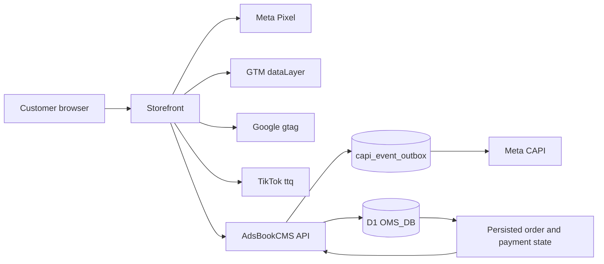

# AdsBookCMS Meta Pixel, CAPI, GTM, TikTok, and Google Ads Specification

> Verified against disk: 2026-08-17 @ `3de2b01`

This document owns the technical tracking contract for AdsBookCMS-rendered and headless storefronts. It covers event semantics, identity, browser/server boundaries, deduplication, durable delivery, store configuration, and verification. It does not claim attribution certainty, legal compliance, consent applicability, or live provider acceptance.

AdsBookCMS installs as **one Worker = one store** ([`ARCHITECTURE.md`](./ARCHITECTURE.md), [`DECISIONS.md`](./DECISIONS.md) ADR-001/ADR-002), so "store configuration" below always means the single `stores` row of this install, resolved at request time from D1 with environment fallback.

## 1. Architecture



The storefront owns browser tag loading and event presentation. AdsBookCMS owns tracking configuration, public payload validation, canonical catalog/order identity, Purchase qualification, durable CAPI delivery, and server CAPI credentials.

A headless storefront may use a different framework and design, but it must not fork event meaning, product identity, or Purchase qualification.

## 2. Current Implementation Boundary

### Implemented in AdsBookCMS-rendered routes

- `MetaPixelBase.astro` resolves a valid Pixel ID from D1 with environment fallback.
- `GtmBase.astro` resolves and validates the GTM container ID.
- `GoogleAdsBase.astro` resolves a complete Google Ads conversion ID/label pair, emits the region-scoped Consent Mode v2 defaults (§8), and exposes `window.__PS_PUSH_GOOGLE_CONVERSION__`.
- Page, product, landing, and thanks trackers emit the supported browser events.
- `/api/meta-event` accepts only supported event names and validates event ID, same-origin source URL, product/value payload, and bounded customer data before enqueueing to the CAPI outbox.
- `/api/v1/tracking/events` provides the same contract for headless storefronts behind developer-API-key auth (§9).
- `src/lib/capi-outbox.ts` records every CAPI event in D1 before transmission and retries failures (§10).
- Click identifiers are captured in middleware into a first-party cookie and persisted on the order (§7).
- `/admin/ads/meta` manages Pixel ID plus masked CAPI readiness and supports an explicit Test Events request.
- `/admin/ads/google` manages GTM independently and validates the Google Ads conversion pair.
- `/thanks` gates Purchase from recorded order/payment state and uses browser duplicate guards.

### Headless storefront bootstrap — what ships and what does not

`src/pages/api/v1/storefront.ts` **ships** a storefront bootstrap endpoint. `GET /api/v1/storefront` returns store identity, home content, payment capability (COD flag, COD-disabled province codes, supported methods), and a `tracking` block containing exactly four non-secret identifiers:

- `meta_pixel_id`
- `google_ads_conversion_id`
- `google_ads_conversion_label`
- `google_tag_manager_id`

`meta_capi_token` is never in the response. It is not a keyless public endpoint: `validateHeadlessRequest()` requires a developer API key via `X-App-Key`, `X-Api-Key`, or `Authorization: Bearer`, verifies it against `developer_api_keys` (SHA-256 lookup plus secret verification, revoked keys rejected), and then enforces the origin allowlist.

Genuinely not yet implemented:

- a **keyless** public bootstrap for storefronts that cannot hold a server-side key;
- a framework-neutral tracking adapter package;
- a completed cross-storefront consent adapter;
- automated verification across every external storefront repository.

Do not expose `meta_capi_token` to solve the keyless-bootstrap gap. See [`STOREFRONT_INTEGRATION.md`](./STOREFRONT_INTEGRATION.md) for the planned adapter boundary.

## 3. Store Configuration

`getStoreAdsConfig(locals)` resolves:

- `meta_pixel_id` and `meta_capi_token`;
- `google_tag_manager_id`;
- `google_ads_conversion_id` and `google_ads_conversion_label`.

D1 values take precedence over environment fallback. Changes in Ads & Tracking apply to subsequent requests without rebuilding the Worker.

Security rules:

- CAPI tokens and webhook secrets are never returned by read APIs;
- blank token submissions preserve the active secret;
- Google Ads conversion ID and label are both present or both absent;
- browser configuration may contain only non-secret identifiers;
- isolation between stores is the deployment boundary — a second store is a second install with its own D1 and its own credentials, not a scope column.

## 4. Canonical Event Semantics

| Meta event | GTM event | Browser trigger | Qualification |
| --- | --- | --- | --- |
| `PageView` | `page_view` | Eligible page load | Tag and consent state permit browser tracking. |
| `ViewContent` | `view_item` | One canonical product is viewed | Canonical D1 product ID and current D1 value. |
| `AddToCart` | `add_to_cart` | Current direct-response form reaches qualified customer intent | Never a scroll, impression, or arbitrary CTA click. |
| `InitiateCheckout` | `begin_checkout` | A valid checkout submit attempt begins | Product, variant, value, and customer boundary have passed browser validation; server still revalidates. |
| `Purchase` | `purchase` | The qualifying persisted order state is confirmed | COD requires persisted order success; online payment requires authenticated paid reconciliation. |

`src/lib/meta-event-contract.ts` accepts exactly these five names. The repository does not map every interaction to `Lead` or `Purchase`. Analytics UI events must remain separate from optimization events.

## 5. Product Catalog Identity

Every product event carries the **catalog item id** in `content_ids`:
`p{product_id}-v{variant_id}`, for example `p1-v11`. That is the same string the
Google and Meta feeds publish as `<g:id>`, and it has to be byte-identical or
Advantage+ and Dynamic Product Ads match nothing — silently, with no error and no
diagnostic anywhere.

The catalog is variant-level, so the id names a variant, not a product. Where no
variant has been chosen (a product page, a landing page), the event carries the
**first** variant's id. Where one has (AddToCart, InitiateCheckout, Purchase), it
carries the chosen one. `p{product_id}` alone is the `item_group_id` and is never
sent as a `content_ids` value.

Until 2026-08-17 this said the bare D1 `products.id` — which is what the Pixel
actually sent, while the feed published `10000 + id`. Nothing matched.

- D1 product ID: tracking and external catalog identity.
- D1 variant ID: order selection identity when variant detail is needed.
- Slug: routing label only.
- SKU: internal inventory label only.
- Frontend list index, campaign alias, provider ID, or legacy seed name: invalid tracking identity.

`ViewContent`, `AddToCart`, `InitiateCheckout`, browser Purchase, server CAPI Purchase, and any Meta Commerce Catalog integration must agree on the same product ID.

## 6. Event ID and Purchase Deduplication

### Intended contract

A funnel event and a Purchase event must not reuse one ID.

1. Create a dedicated Purchase event ID for the order attempt.
2. Return and preserve that ID with the persisted order state.
3. Browser Pixel Purchase and server CAPI Purchase use the identical string.
4. The thanks flow applies both browser guards:
   - `once('Purchase_' + purchaseEventId)`;
   - `once('Purchase_order_' + orderId)`.
5. Refresh, revisit, duplicate callback, or repeated polling must not create another Purchase for the same qualifying order.
6. A new valid order receives a new Purchase event ID.

### What ships today

All six guards hold as of 2026-08-16. Both legs key Purchase on the `INV-` order number:

| Leg | Value sent | Source |
| --- | --- | --- |
| Browser `fbq('track', 'Purchase', …, { eventID })` | the `INV-` order number | `MetaThanksTracker.astro` derives it from `order_number` in the `/api/order-status` response — the same D1 column the server leg uses — and fires nothing at all if it cannot be resolved |
| Server CAPI | the `INV-` order number | `src/pages/api/meta-event.ts` sets `eventId` from `purchaseOrder.order_number` for every `Purchase` |

Until 2026-08-16 the browser minted `purchase_<productSlug>_<random>` instead, which the server discarded — so the two legs never matched and Meta counted each Purchase twice. The fix aligned the browser onto the server's key rather than weakening the server gate, because the order-number key is what makes the server leg idempotent per order. **The correction is forward-only:** Meta deduplicates at ingestion inside a 48-hour window and offers no retroactive merge, so historical Purchase counts and values remain inflated and historical ROAS remains understated. Treat the deploy date as a reporting break, not a performance drop.

The server gate is unchanged: `/api/meta-event` requires `order_number` plus a valid `status_token` before it will emit any Purchase, and returns `404` for an unknown or mismatched token.

Server-side, `capi_event_outbox.event_id` carries a `UNIQUE` constraint and `enqueueCapiEvent()` uses `INSERT OR IGNORE`, so a replayed request returns `{ deduplicated: true }` instead of producing a second outbound conversion. Combined with the order-number key, that means one CAPI Purchase per order for all time — a durable dedupe layer above Meta's own `event_id` handling.

A local duplicate guard proves only the browser and database paths. CAPI acceptance and Meta deduplication require a separately observed provider response.

## 7. Customer Matching and Click-ID Attribution

### Hash before CAPI

Normalize and SHA-256 hash supported customer identifiers such as:

- phone after Indonesian international normalization;
- first and last name after trim and normalization;
- external ID when its canonical source is defined.

### Never hash Meta browser identifiers

Preserve `_fbp` and `_fbc` exactly as issued when present. They are attribution identifiers, not Advanced Matching fields. Do not place them in URLs or logs.

### Request-derived context

Client IP and user agent are derived at the server boundary (`getClientIp(request.headers)` and the `user-agent` header) rather than trusted from arbitrary browser fields.

`_fbp` and `_fbc` are derived the same way. `readMetaBrowserIds(request)` in
`src/lib/click-ids.ts` reads them off the request cookie header — both are
first-party on the storefront origin and every tracker posts same-origin, so
they arrive without a tracker having to include them. A value the browser *did*
send still wins; the server read is the floor, not a replacement.

This is deliberate rather than defensive. Before it, `ViewContent` and
`PageView` posted no `user_data` at all, and on a live install that was 2992 of
3115 delivered events — 96% of the CAPI volume — reaching Meta with nothing but
an IP and a user agent. `fbc` was absent from all 3115, Purchases included. The
server read also holds in the cases a browser read cannot: the pixel deferred,
blocked by an extension, or simply not loaded when the event fires. For `fbc`
specifically it falls back to the `_fbc` synthesized into the click-ID cookie by
the middleware at landing, which exists on ad traffic *before* the pixel runs.

### Click identifier capture and persistence

Click-ID preservation is owned by `src/lib/click-ids.ts`, `src/middleware.ts`, and the `orders.ad_click_ids` column — **not** by `src/lib/order-schema.ts`, which carries no click-ID fields.

`CLICK_ID_KEYS` in `src/lib/click-ids.ts` is a single list covering all four families:

| Family | Keys |
| --- | --- |
| Google | `gclid`, `gbraid`, `wbraid` |
| Meta | `_fbp`, `_fbc`, `fbclid` |
| TikTok | `ttclid` |
| UTM | `utm_source`, `utm_medium`, `utm_campaign`, `utm_content`, `utm_term` |

Flow:

1. **Capture.** `src/middleware.ts` runs `parseClickIdsFromUrl(url)` on every non-private request. Values must match `/^[A-Za-z0-9._-]{1,256}$/` or they are dropped. When `fbclid` arrives without `_fbc`, the library synthesizes `_fbc` as `fb.1.<timestamp>.<fbclid>`.
2. **Store.** Matching values are JSON-serialized into the cookie named by `CLICK_ID_COOKIE` — currently `adsbook_click_ids` — with `Max-Age` of 90 days, `Path=/`, and `SameSite=None; Secure` on HTTPS (`SameSite=Lax` otherwise). `_fbp` and `_fbc` are additionally re-issued as their own first-party cookies so Meta's own readers find them.
3. **Read back.** `readClickIdCookie(request)` is called by `src/pages/api/submit-order.ts`, `src/pages/api/submit-middle-order.ts`, and `src/pages/api/v1/checkout.ts`; `readMetaBrowserIds(request)` wraps it for `src/pages/api/meta-event.ts`. Cookies ride along with the submit request, so no hidden form fields are needed. Malformed or hand-edited cookie values parse to `{}` rather than throwing inside the order path.
4. **Persist.** The serialized value is written to `orders.ad_click_ids` (migration `0024_daily_typhoid_mary.sql`).
5. **Classify.** `src/lib/traffic-source.ts` reads that stored JSON and derives a `TrafficSourceType` of `meta`, `google`, `tiktok`, `organic`, or `custom`, precedence Meta → Google → TikTok → UTM heuristics. The admin surfaces it through `TrafficSourceBadge` in `OrdersTable.tsx` and `OrderDetail.tsx`.

The cookie is `adsbook_click_ids`, renamed from `zanoby_click_ids` on 2026-08-16. `readClickIdCookie()` still **reads** the legacy name when the current one is absent, so attribution captured before the rename survives; nothing writes the legacy name, so it ages out with its own 90-day expiry.

Why this matters for COD: the real conversion happens days after the click, when the courier collects cash. Without the click ID captured at landing and stored on the order, delivered revenue can never be uploaded back as an offline conversion, and Smart Bidding only ever learns from unconfirmed form submissions.

### Cross-frame and cross-page preservation

- `src/lib/checkout-navigation.ts` re-attaches all twelve tracking keys to intermediate checkout navigation URLs, reading from the current query string first and the `adsbook_click_ids` `sessionStorage` entry second. Checkout **completion** URLs are deliberately restricted to opaque order lookup values so no PII or attribution string leaks into a shareable confirmation link.
- `public/adsbook-form-widget.js` carries the parent-page logic for embedded storefronts. It syncs the same twelve keys into the iframe `src`, recovers `_fbp`/`_fbc` from parent cookies when absent from the URL, and listens for origin-checked `postMessage` events. It is served by the store, so a merchant page picks up fixes on deploy — unlike the inline variant it replaced, which froze the same logic onto the merchant's page permanently and was removed on 2026-08-16.

## 8. TikTok Signal Boundary

TikTok support is narrower than Meta or Google and should not be described as a full integration.

What exists:

- `ttclid` is a first-class member of `CLICK_ID_KEYS`, so it is captured in middleware, stored in the cookie for 90 days, persisted to `orders.ad_click_ids`, and forwarded through checkout navigation and embed frames exactly like `gclid` and `fbclid`.
- `src/lib/traffic-source.ts` classifies an order as `tiktok` when `ttclid` is present, or when `utm_source` contains `tiktok` or `tt`.
- The embed snippets fire **no Purchase of their own**. `public/adsbook-form-widget.js` does fire Meta `AddToCart` / `InitiateCheckout` and a `gtag` event on the host page when those pixels are already present; what it never fires is a conversion. Until `c967faa` (2026-08-16) the parent listener fired Meta `Purchase`, a Google `conversion`, and TikTok `CompletePayment` on `checkout-redirect`/`order-complete` on a positive total alone — unqualified, before payment was verified, and with no `event_id`. That code is gone, and `src/lib/embed-markup.test.ts` now asserts that no generated snippet contains `fbq`, `ttq`, `gtag`, `dataLayer`, or any conversion event name.

What does **not** exist:

- no TikTok pixel base component — AdsBookCMS never loads `ttq` itself, so the `CompletePayment` call only fires when the **host page** already has the TikTok pixel installed;
- no TikTok pixel ID field in store configuration;
- no TikTok Events API (server-side) delivery, and no outbox rows for TikTok;
- no `event_id` deduplication between any browser `ttq` call and a server event;
- no TikTok conversion is emitted from an embedded checkout at all, by design — the embed sits on a third-party page, has no order number at redirect time, and cannot reach the database, so it can never qualify a purchase.

The embed `postMessage` types use the `adsbook:` prefix, renamed from `cmsads:` on 2026-08-16 together with the widget file and its custom element. The consequence differs per snippet, and the difference is operationally important:

| Snippet | Where its code lives | On deploy |
| --- | --- | --- |
| `widget` | `/adsbook-form-widget.js`, served by the store | **self-heals** — the browser revalidates it; only `/_astro/*` is immutable |
| ~~`autoHeightIframe`~~ | **inline on the merchant's own page** | **Removed 2026-08-16.** It could never heal, so it is no longer generated. Pages that already pasted it still fire the old unqualified Purchase, Google conversion and TikTok CompletePayment and always will — deletion stops new ones, it cannot retract existing ones |
| `plainIframe` | nothing but an iframe | unaffected; never carried tracking |

An embed pasted before 2026-08-16 must be re-copied from `/admin/products`. The product now **detects** this: every generated snippet stamps a version marker onto its frame URL, and `/embed/form` logs `embed-snippet-stale` with the merchant's origin when the marker is missing or behind. An absent marker reads as version 1, so every pre-existing snippet is caught. A merchant page served over HTTP sends no referrer and cannot be attributed.

## 9. Google Ads Conversion Signal Protocol

### Tag integration

1. **Google Tag (`gtag.js`)**: loaded by `GoogleAdsBase.astro` when a valid `google_ads_conversion_id` (`AW-XXXXXXXXX`) and `google_ads_conversion_label` are configured. Both must be present; the component renders nothing otherwise. The 153 KB library download is **deferred** to first interaction or 2500 ms, whichever comes first — the same trade `MetaPixelBase.astro` takes, made after it measured 228 ms of a product page's 750 ms blocking time. `window.gtag` is a `dataLayer.push` shim declared inline, so the consent, `js` and `config` calls queue in their original order and only the download moves. A conversion never waits on the timer: `__PS_PUSH_GOOGLE_CONVERSION__` calls `window.__PS_LOAD_GOOGLE_TAG__()` before pushing. Only remarketing `page_view` is affected, and only for a visitor who leaves inside the timeout.
2. **Google Tag Manager**: loaded by `GtmBase.astro` when `google_tag_manager_id` (`GTM-XXXXXXX`) is defined. Pushes `page_view`, `view_item`, `add_to_cart`, `begin_checkout`, and `purchase` to `window.dataLayer` using the GA4/GTM ecommerce schema.
3. **Global execution helper**: `window.__PS_PUSH_GOOGLE_CONVERSION__(value, transactionId, userData)` builds `{ send_to: id + '/' + label, value, currency: 'IDR' }`, appends `transaction_id` **only when truthy** (an empty string would make every order collide instead of dedupe), attaches `user_data` when supplied, and calls `gtag('event', 'conversion', payload)`.

### Enhanced Conversions for Web

Executed inside `MetaThanksTracker.astro` after order verification. The same raw phone is normalized once, then hashed **twice, differently**, because Meta and Google specify different formats:

| Consumer | Value hashed | Example input to SHA-256 |
| --- | --- | --- |
| Meta `ph` / `external_id` | E.164 **digits only** | `6281234567890` |
| Google `sha256_phone_number` | E.164 **including the leading `+`** | `+6281234567890` |

Never share one hash between the two.

Phone normalization is **one implementation**, `src/lib/meta-identity.ts`:
strip every non-digit, drop a `00` international prefix, then map `620…`, `0…`
and a bare `8…` onto `62…`, and reject anything outside 8–15 digits. The server
CAPI leg imports it, `form-hybrid.ts` and `form-middle.ts` import it, and the
inline thanks tracker carries a copy that `meta-identity.test.ts` fails on if it
drifts. Until 2026-08-19 the two hosted forms hashed the raw `08…` digits and
the thanks tracker converted only a leading zero, so `8…` and `+62…` input
produced a browser hash the server leg never produced — two people, one buyer,
and a hash that looks correct either way.

The two platforms also normalize **names** differently, so they do not share a
value:

| Consumer | Rule | `Siti Nur Aisyah` becomes |
| --- | --- | --- |
| Meta `fn` / `ln` | lowercase, strip every non-alphanumeric | `siti` / `nuraisyah` |
| Google `sha256_first_name` / `sha256_last_name` | trim and lowercase only | `siti` / `nur aisyah` |

Google `user_data` fields sent, in the shape gtag actually reads:

```js
user_data: {
  sha256_phone_number,          // SHA-256 of `+62…`
  address: {
    sha256_first_name,
    sha256_last_name,
    city, region, postal_code,  // unhashed
    country: 'id',
  },
}
```

The name hashes sit inside `address` because that is where gtag looks for them;
sent at the top level, as they were until 2026-08-19, they are ignored and match
nobody. Google treats first name, last name, postal code and country as one
address match key, so the unhashed fields travel with them. Email is not part of
the browser Enhanced Conversions payload today: the only address the funnel holds
for a non-COD order is synthesized from the phone number, and a synthetic address
cannot match a Google account.

### Consent Mode v2 — region-scoped, two calls

`GoogleAdsBase.astro` issues **two** `gtag('consent', 'default', …)` calls, in this order. Documenting only the second one misstates the legally load-bearing half.

**Call 1 — region-scoped denial (fires first):**

```js
gtag('consent', 'default', {
  ad_storage: 'denied',
  ad_user_data: 'denied',
  ad_personalization: 'denied',
  analytics_storage: 'denied',
  region: [ /* 32 ISO codes */ ],
  wait_for_update: 500,
});
```

The `region` array holds **32** codes: the 27 EU member states plus `IS`, `LI`, `NO` (EEA), `GB`, and `CH` — `AT, BE, BG, HR, CY, CZ, DK, EE, FI, FR, DE, GR, HU, IS, IE, IT, LV, LI, LT, LU, MT, NL, NO, PL, PT, RO, SK, SI, ES, SE, GB, CH`. `wait_for_update: 500` holds tags for 500 ms so a consent management platform can answer before anything fires.

**Call 2 — unscoped grant (fires second):**

```js
gtag('consent', 'default', {
  ad_storage: 'granted',
  ad_user_data: 'granted',
  ad_personalization: 'granted',
  analytics_storage: 'granted',
});
```

Because Google applies the most specific matching region rule, a visitor from any of the 32 listed regions gets `denied`; everyone else gets `granted`. The deliberate rationale in the source comment: the consent requirement is EEA/UK law, this storefront sells to Indonesia and ships no consent management platform, so a global `denied` default would destroy the store's own conversion signal to satisfy a rule that does not govern its traffic.

Consequences to keep in mind:

- there is **no CMP in the repository**, so nothing ever calls `gtag('consent', 'update', …)`. The 500 ms `wait_for_update` window expires with no answer, and EEA/UK visitors stay denied for the whole session.
- if this store ever advertises into the EEA or UK, a real CMP and an `update` call become mandatory before that traffic can be measured at all.
- a storefront that needs different behavior must change `GoogleAdsBase.astro`; the region list is compiled into the component, not configurable per store.

### Transaction ID deduplication

1. Every conversion payload includes `transaction_id` set to the persisted **order number**, not a numeric row ID.
2. Order numbers come from `src/lib/order-persistence.ts` and use `` `INV-${10000 + id}` `` for completed orders — e.g. order row `1` is `INV-10001`. Abandoned/partial leads use `` `ABN-${10000 + id}` `` and are converted to the `INV-` form when the order completes. No order number is ever minted with an `ORD-` prefix. The string appears three times as operator-facing example copy in `src/pages/admin/ads/meta.astro` and `google.astro`; it is not produced by `order-persistence.ts`.
3. Deduplication applies across GTM ecommerce `purchase` events, direct `gtag` conversion events, and any future Google Ads API offline conversion upload — all three must send the identical `INV-` string.
4. Refreshing `/thanks` or revisiting the confirmation URL does not re-trigger the conversion, thanks to the `once('Purchase_order_' + orderId)` local guard.

### Smart Bidding signals

1. Conversion values use actual item price multiplied by quantity, in IDR.
2. COD orders qualify on successful server order creation; prepaid online orders qualify only after authenticated `is_paid: true` reconciliation.
3. Keeping unverified checkout attempts out of the conversion feed is what prevents Target CPA / Target ROAS from optimizing toward non-revenue.

## 10. CAPI Event Outbox

`src/lib/capi-outbox.ts` is the durable delivery layer for Meta CAPI. Its purpose: a conversion event is recorded in D1 **before** it is transmitted, so a network blip, a Meta rate limit, or an expired token cannot silently discard revenue signal.

### Storage

Table `capi_event_outbox` (see `src/db/migrations/`): `id`, `event_id` (UNIQUE), `event_name`, `payload` (JSON), `status` (default `pending`), `attempts` (default 0), `max_attempts` (default 5), `last_error`, `next_retry_at`, `created_at`, `updated_at`, with index `capi_event_outbox_due_idx` on `(status, next_retry_at)`.

### Public functions

| Function | Behavior |
| --- | --- |
| `enqueueCapiEvent(db, event)` | `INSERT OR IGNORE` as `pending`. Returns `false` when `event_id` is already known, making a replayed browser request a no-op instead of a duplicate conversion. |
| `deliverCapiEvent(db, eventId, pixelId, token)` | Sends one already-enqueued `pending` event immediately. Returns `false` if no matching pending row exists. |
| `drainCapiOutbox(db, pixelId, token)` | Retries events whose `next_retry_at` has elapsed and whose `attempts < max_attempts`, oldest first, **bounded to 10 rows per call**, so a burst of failures cannot turn one storefront request into a long-running drain. Returns the number sent. |
| `decideRetry(outcome, attempts, maxAttempts)` | Pure function holding the backoff ladder, testable without a database or a live Meta. |

### Retry decision rules

- success → `sent`, no further attempts;
- Meta error code `190` (dead token) → `failed` immediately; retrying only burns quota;
- `attempts + 1 >= max_attempts` → `failed`;
- Meta error codes `4`, `17`, `613` (rate limits) → `pending` with a flat **15-minute** delay;
- any other failure → `pending` with `min(2^nextAttempt, 60)` **minutes**, i.e. doubling from 2 minutes and capping at 1 hour;
- an unparseable stored payload is marked `failed` without transmission, since it can never succeed.

On a successful send the `attempts` counter is not incremented and `last_error` is cleared.

### Why no cron

Draining is opportunistic, triggered by later storefront traffic and scheduled through `waitUntil()`. There is no cron trigger and no queue binding, because the Astro Cloudflare adapter owns the Worker entrypoint. A store with no traffic therefore does not drain; a failed event waits for the next visitor.

## 11. Browser and Server Payload Boundary

### `/api/meta-event` (first-party, same-origin)

Validates through `validateMetaEventPayload()`, then:

1. resolves store ads config; returns a non-error `skipped` response when Pixel ID or CAPI token is unconfigured;
2. applies the extra Purchase gate against persisted order/payment state;
3. `enqueueCapiEvent()` → returns `{ deduplicated: true }` if already known;
4. `deliverCapiEvent()` for immediate delivery;
5. schedules `drainCapiOutbox()` through `locals.cfContext.waitUntil()`.

Rejected before any outbound call: unsupported event names, malformed event IDs, cross-origin source URLs, invalid product IDs, invalid values/currency, oversized customer payloads.

### `/api/v1/tracking/events` (headless)

`src/pages/api/v1/tracking/events.ts` accepts `POST` with `OPTIONS` preflight and applies the **same** `validateMetaEventPayload()` contract, so a headless storefront cannot widen event semantics. Differences from the first-party route:

- authentication is `validateHeadlessRequest()` — developer API key plus origin allowlist — instead of same-origin;
- `user_data` accepts the fuller headless set: `phone`, `name`, `email`, `city`, `province`, `postalCode`, `country`, `externalId`, `fbp`, `fbc`, with `clientIp` and `userAgent` always derived server-side from request headers;
- returns `503 DATABASE_UNAVAILABLE` when the D1 binding is missing, `400 INVALID_TRACKING_PAYLOAD` on a contract violation, `200 { skipped: true }` when tracking is unconfigured, and `200 { event_id, event_name, delivered, queued }` on success;
- the same enqueue → deliver → `waitUntil(drain)` sequence runs.

Conceptual Purchase data:

```json
{
  "event_name": "Purchase",
  "event_id": "INV-10001",                       // the order number, on both legs
  "event_source_url": "https://shop.example.com/thanks",
  "user_data": {
    "ph": ["<sha256-e164-digits-only>"],
    "fn": ["<sha256-normalized-first-name>"],
    "fbp": "<raw-_fbp-if-present>",
    "fbc": "<raw-_fbc-if-present>"
  },
  "custom_data": {
    "content_ids": ["p1-v11"],
    "content_type": "product",
    "value": 135000,
    "currency": "IDR"
  }
}
```

This example describes field meaning; it is not merchant data or a live credential.

## 12. Payment and Purchase Qualification

### COD

A successfully persisted COD order may qualify as Purchase because the commercial order has been accepted. Checkout persistence must succeed first. Shipping confirmation and Mengantar dispatch remain later operational states and do not create a second Purchase. See [`MENGANTAR_INTEGRATION_SPEC.md`](./MENGANTAR_INTEGRATION_SPEC.md).

### Online payment

Order creation alone is not Purchase. `/api/order-status` reads the existing D1 order/payment state. Only authenticated AutoLaris paid reconciliation qualifies the online Purchase path. Unknown orders return `404`; unpaid or failed states must not be rewritten as Purchase.

Payment success, provider acceptance, ad-platform acceptance, attribution, and reported revenue are separate observable facts.

## 13. Consent and Privacy Boundary

The implementation must:

- avoid blocking checkout when analytics is unavailable;
- avoid raw personal or payment data in URLs, dataLayer, localStorage, logs, screenshots, or public config;
- distinguish required commerce storage from optional measurement storage;
- record consent state separately from event delivery;
- avoid claiming jurisdiction-specific compliance without a reviewed legal basis.

Current state: Consent Mode v2 defaults ship as described in §9, but there is **no consent management platform and no `gtag('consent', 'update', …)` call anywhere in the repository**, and no framework-neutral consent adapter for headless storefronts. Both remain planned work.

## 14. Headless Storefront Implementation Checklist

An agent implementing a new frontend must:

1. obtain a developer API key and confirm the storefront origin is on the allowlist;
2. read non-secret browser identifiers from `GET /api/v1/storefront` (`tracking` block);
3. keep the CAPI token server-side — it is never returned by any read API;
4. use canonical D1 product IDs for all supported events;
5. generate stable per-event IDs and a dedicated per-order Purchase event ID;
6. preserve `_fbp` and `_fbc` un-hashed when present;
7. normalize and hash Advanced Matching fields before CAPI, remembering Meta wants digits-only and Google wants a leading `+`;
8. preserve click identifiers — including `ttclid` — through the submit path, or rely on the first-party cookie riding along with the request;
9. send `transaction_id` as the `INV-` order number, never a numeric row ID;
10. post server events to `POST /api/v1/tracking/events` rather than calling Meta directly, so the outbox owns retries and dedupe;
11. gate COD and online Purchase according to recorded backend state;
12. apply consent behavior without blocking the commerce journey;
13. inspect browser Pixel, dataLayer, gtag, and API requests on the exact store origin;
14. record local browser evidence separately from Meta Test Events, live API acceptance, attribution, and campaign results.

## 15. Verification Contract

Run the repository's own commands:

```bash
npm test
npm run check
npm run build
```

`npm test` runs `node --experimental-strip-types --test src/lib/*.test.ts`, which covers `capi-outbox.test.ts`, `click-ids.test.ts`, `traffic-source.test.ts`, `checkout-navigation.test.ts`, `embed-markup.test.ts`, `order-persistence.test.ts`, and `e2e-full-funnel.test.ts`.

For the selected storefront:

- inspect `PageView`, `ViewContent`, qualified `AddToCart`, `InitiateCheckout`, and Purchase triggers;
- verify `content_ids`, `value`, `currency`, event ID, source URL, and customer-data boundaries;
- compare the browser `eventID` against the server CAPI `event_id` for the same order — §6 and the code say they now match on the `INV-` order number; record the observed pair rather than assuming it;
- verify `transaction_id` matches the persisted `INV-` order number;
- verify refresh/revisit guards;
- verify COD and online gates;
- verify both Consent Mode default calls appear in `dataLayer` in the right order;
- verify `capi_event_outbox` rows reach `sent`, and inspect `last_error` and `attempts` when they do not;
- verify no CAPI token appears in HTML, JavaScript, network response, or logs;
- use Meta Test Events only with an operator-provided test code and explicit outbound-call approval.

A passing local test or build does not prove live Meta/Google/TikTok acceptance, Event Match Quality, attribution, catalog health, or campaign performance. Record exact observed results and non-actions in `STATUS.md` and `BUILD-LOG.md`.
